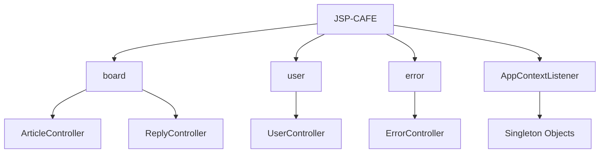

# 🌟 JSP-CAFE 🌟
<p align="center">
  
  
  
</p>

## 🏗️ 프로젝트 구조
JSP-CAFE는 견고한 MVC 아키텍처를 기반으로 구축되었습니다. 각 컴포넌트는 다음과 같은 역할을 수행합니다

- **board**: 게시글과 댓글의 CRUD 작업을 관리합니다.
- **user**: 사용자 인증, 프로필 관리 등 사용자 관련 기능을 담당합니다.
- **error**: 사용자 친화적인 에러 페이지를 제공합니다.
- **AppContextListener**: 애플리케이션의 핵심 객체들을 싱글톤으로 관리하여 리소스 효율성을 극대화합니다.



## 🎯 테스트 커버리지 90% 돌파

JSP-CAFE 프로젝트는 높은 품질과 안정성을 보장하기 위해 철저한 테스트 전략을 채택했습니다

- **라인 커버리지 90% 이상 달성**: 코드의 대부분이 테스트되어 버그 발생 가능성을 최소화했습니다.
- **Mockito 대신 직접 작성한 stub 사용**: 이를 통해 의존성을 줄이고, 테스트의 의도를 더 명확히 드러냈습니다.
- **테스트 속도 개선**: stub 사용으로 테스트 실행 속도가 크게 향상되었습니다.
- **H2 인메모리 데이터베이스 활용**: 어떤 환경에서도 일관된 테스트 결과를 얻을 수 있게 되었습니다.

## 🛠️ MAVEN 빌드 툴 사용
- JSP-CAFE 프로젝트는 Maven을 빌드 도구로 채택했습니다.
- Maven의 특성상 초기 빌드 시간이 다소 길어질 수 있습니다.
- (Gradle이 대세인건 이유가 있다.)


## 🚀 쿼리 성능 개선
**데이터베이스 쿼리 성능을 대폭 개선하여 사용자 경험을 향상시켰습니다.**
### 기존
```sql
SELECT * FROM articles WHERE is_deleted = false ORDER BY update_at DESC LIMIT ? OFFSET ?
```
**실행 시간: 약 5초**

### 커버링 인덱스
```sql
SELECT * FROM articles AS a 
JOIN (
  SELECT id 
  FROM articles 
  WHERE is_deleted = false 
  ORDER BY update_at DESC 
  LIMIT ? OFFSET ?
) AS t ON a.id = t.id
```
**실행 시간: 약 1초**

이를 통해 쿼리 실행 시간을 **80%** 단축하는 놀라운 성능 개선을 달성했습니다!

## 테크 스펙
- [JSP-cafe-step1](https://docs.google.com/document/d/14rgIsnvI6VV2fuSGspnGgycXpNN7gq4a5t5X9LOUdt0/edit?usp=sharing)
- [JSP-cafe-step2](https://docs.google.com/document/d/1dTwFNlb2jsj29X9_dxvy80WbCN7RyrllndpA_C7nRiM/edit?usp=sharing)
- [JSP-cafe-step3](https://docs.google.com/document/d/1kP-xtYlmY5_-NAlQetA6UCAgCyhRBrLWRV44c95FSO8/edit?usp=sharing)
- [JSP-cafe-step4](https://docs.google.com/document/d/1AEkIEJgDR2HVu-KSn70rsnIZ0zV3uSBClAqRBniJmSc/edit?usp=sharing)
- [JSP-cafe-step5](https://docs.google.com/document/d/1ziChxUcKd02mxKEp9Wf6fbfY0ACdLGju9I9ueKUv2oE/edit?usp=sharing)
- [JSP-cafe-step5,6](https://docs.google.com/document/d/1NGWmaokUmJAQIE22BLNxsbnaxJJlt3ouv221Db5GvOk/edit?usp=sharing)
- [JSP-cafe-step7](https://docs.google.com/document/d/1ntrtdQDNqJCaGG0sBf2wAOlKfskOaq1towM7ntXr4aY/edit?usp=sharing)

## 🎓 프로젝트 회고
JSP-CAFE 프로젝트를 통해 다음과 같은 귀중한 경험을 쌓을 수 있었습니다:

1. **레거시 기술 활용**: Servlet/JSP를 사용하여 현대적인 개발 방식을 적용해보는 유익한 경험이었습니다.
2. 성능 최적화: 커버링 인덱스 등의 고급 DB 최적화 기법을 실제 프로젝트에 적용해볼 수 있었습니다.
3. **테스트 주도 개발**: 높은 테스트 커버리지를 유지하며 개발하는 과정에서 코드의 품질과 신뢰성을 크게 향상시킬 수 있었습니다.
